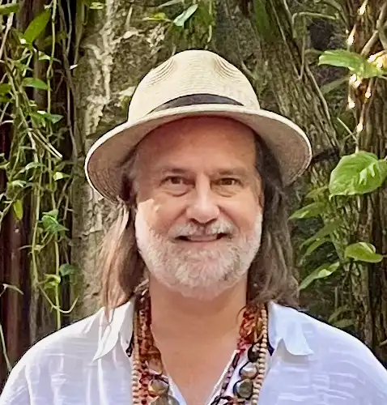

{:.circle.shadow}

## Retired
I’m a retired private business owner that has sold everything from software, real estate, info-products, and the owner of a marketing agency with the core team based in Manila Philipines.

## Business Philosophy
Learn about my [Dolphin Entreprenuer philosophy in business](https://socapglobal.com/2017/08/forget-shark-tank-dolphin-entrepreneur-instead/) that I wrote for Social Capital Markets formally Conscious Company Magazine.

Since I became a full-time entrepreneur in 1996 after five years in the corporate world I’ve learned a lot from my successes and especially failures. I have written the books below to share my experience on generating a business idea and on hiring virtual workers that I believe is the core of what you need to know to be successful in business.

Since I became a full-time entrepreneur in 1996 after five years in the corporate world I’ve learned a lot from my successes and especially failures. I have written two books and some articles to share my experience on generating a business idea and on hiring virtual workers that I believe is the core of what you need to know to be successful in business.